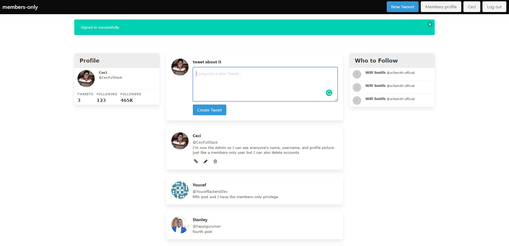

#  🧐 members-only

This is the fourth collaborative project from the Ruby on Rails module from the Microverse program. It consists of making an authentication web app with users who can register, login and logout, with the Devise gem and also have some social media functionality like posting anonymous comments and having restricted views depending on the role of the user, for example, users with the members-only attribute can see the name and picture of these anonymous users and the ones with the role admin can even delete accounts.


## 🔧 Built With these features
- Ruby. v2.6.6
- Ruby on Rails. v6.0.3.3
- Using Rubocop Linters.
- Bulma

## 🔴 Live Demo
[Live Demo Link]()

## 🛠 Getting Started
## Install 
Besides the Video Demo Link, you can run those functions in your own local environment. In order to run, you need to install Ruby in your computer. For windows you can go to [Ruby installer](https://rubyinstaller.org/) and for MAC and LINUX you can go to [Ruby official site](https://www.ruby-lang.org/en/downloads/) for intructions on how to intall it. Then you can clone the project by typing ```git clone https://github.com/Ceci007/forms.git``` on your terminal.

## Run the application
To get a local copy up and running follow these simple example steps.

- Open a terminal
- Copy this code : ```git clone "put the link from github repo"```
- Run the program with this code : ```bundle install```
- Run the program with this code : ```rails db:create rails db:migrate```
- before running ```rails server``` you must run a few more commands: first run ```yarn install --check-files```, ```guard init livereload```, ```rails generate simple_form:install```, 
```rails generate devise:install``` then you can configure the Devise gem.
- now you can run ```rails server```
- Stop the program with: "Ctrl + C" (Windows or Linux) or "Command + C"(Apple)

## Open app in browser

- When the program is running go to your browser
- put: localhost:3000/
- Click on login, register and create a new article
- Enjoy the app.

## ✒️ Authors
👤 **Cecilia Benitez Casaccia**

- Github: [@Ceci007](https://github.com/Ceci007)
- LinkedIn:[LinkedIn](www.linkedin.com/in/cecilia-benítez)

👤 **Youcef Abdellani**

- Github: [@ABDELLANI-Youcef](https://github.com/ABDELLANI-Youcef)
- LinkedIn:[LinkedIn](linkedin.com/in/youcef-abdellani)

## 🤝 Contributing
Contributions, issues and feature requests are welcome!

Feel free to check the [issues page](https://github.com/Ceci007/members-only/issues).

## 📝 License
This project is [MIT](lic.url) licensed.
